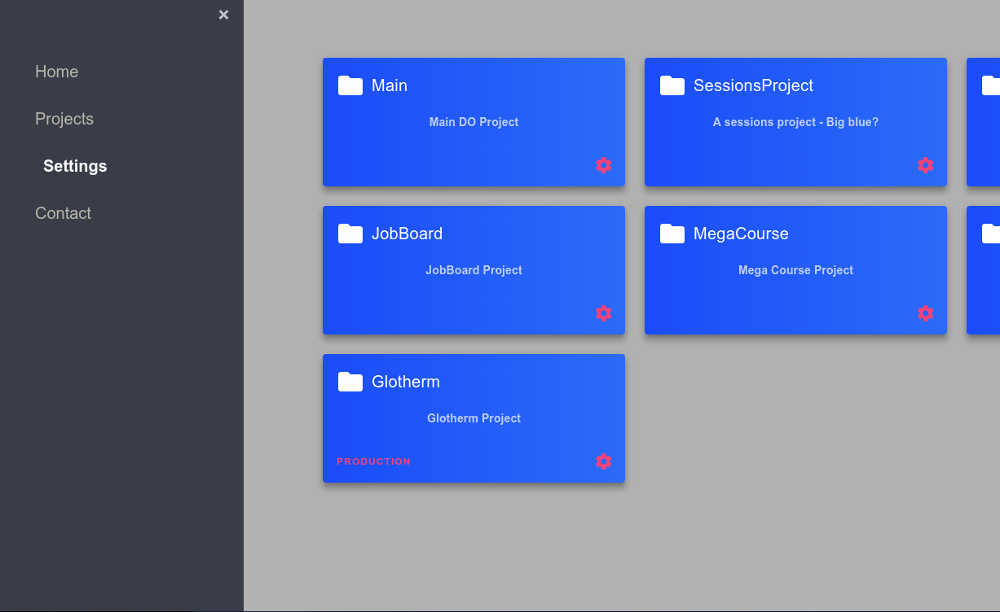
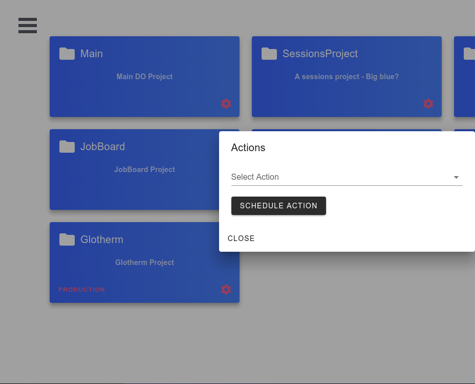

# Missing Digital Ocean Actions 

A simple desktop application for Digital Ocean users ( WIP ). 




It comes with handy functionnalities : 

  - Schedule Shutdown of a resource 
  - Schedule Restart of a resource 
  - Schedule Delete of a resource 
  - Schedule Shutdown of all resources in a Project 
  - Schedule Restart  of all resources in a Project 
  - Schedule Delete  of all resources in a Project 
  - Beforehand notifications 


More functionnalities will be added eventually, basically the ones with the status *Will not implement*  in https://ideas.digitalocean.com/?page=3&project=DO. 


### Build 

```bash
npm install 
npm run build 
```

### Release 

You can download a working binary  for Windows ( .exe )   & Linux ( .AppImage ) from the tags. 


> Built with Vue.js & Electron.js 

 